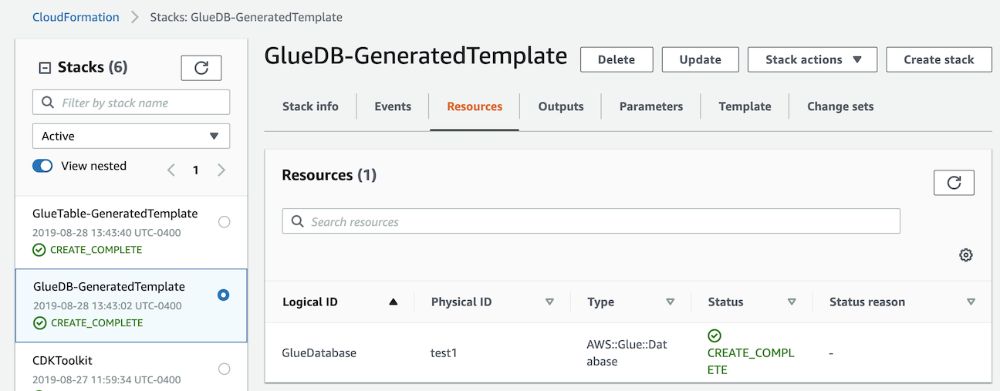

## Overview of the IDO project ( Internal Data Organization )

This project will help you automate migration of Glue databases and tables across accounts using CloudFormation. The framework was built for a customer, it connects to existing AWS account and region, clones the existing Glue database and tables within that region. Given a list of target resources it will generate the appropriate CloudFormation templates for the database and tables, including all of the original parameters from the DDL. The next step will be deploying those CloudFormation templates into the destination account.

#### The Use case

In the customer's environment, they needed to migrate a lot of existing services into different AWS accounts. They have used multiple accounts as Dev/Cert/Prod environments for deployments. The customer needed to automate the whole deployment process through CloudFormation to create a more maintainable and reliable product. In this specific use case they had about 10 different Glue DBs with hundreds of tables that needed to be migrated and automated. The framework has saved them a lot of time and manual effort.

## Why AWS CloudFormation?

Using CloudFormation to deploy and manage services has a number of nice benefits over more traditional methods (AWS CLI, scripting, etc.).

#### Infrastructure-as-Code

A template can be used repeatedly to create identical copies of the same stack (or to use as a foundation to start a new stack).  Templates are simple YAML- or JSON-formatted text files that can be placed under your normal source control mechanisms, stored in private or public locations such as Amazon S3, and exchanged via email. With CloudFormation, you can see exactly which AWS resources make up a stack. You retain full control and have the ability to modify any of the AWS resources created as part of a stack.

#### Self-documenting

Fed up with outdated documentation on your infrastructure or environments? Still keep manual documentation of Tables, Databases, etc.?

With CloudFormation, your template becomes your documentation. Want to see exactly what you have deployed? Just look at your template. If you keep it in source control, then you can also look back at exactly which changes were made and by whom.

#### Intelligent updating & rollback

CloudFormation not only handles the initial deployment of your infrastructure and environments, but it can also manage the whole lifecycle, including future updates. During updates, you have fine-grained control and visibility over how changes are applied, using functionality such as [change sets](https://aws.amazon.com/blogs/aws/new-change-sets-for-aws-cloudformation/), [rolling update policies](http://docs.aws.amazon.com/AWSCloudFormation/latest/UserGuide/aws-attribute-updatepolicy.html) and [stack policies](http://docs.aws.amazon.com/AWSCloudFormation/latest/UserGuide/protect-stack-resources.html).

## File details

The files below are included in this repository:

| File | Description |
| --- | --- | 
| [Generator/glueFactoryClass.py](https://code.amazon.com/packages/AWSProServe_content_GlueMigration/blobs/mainline/--/Generator/glueFactoryClass.py) | This python code is responsible for all of the heavy lifting. It will take the given properties and the generic templates. It will then connect to the original account and will clone the existing glue databases and tables. Then it will generate a CloudFormation template for these resources and output them into the templates folder within the project workspace.  |
| [Generator/glueDBgeneral.template](https://code.amazon.com/packages/AWSProServe_content_GlueMigration/blobs/mainline/--/Generator/glueDBgeneral.template) | This is the Glue DB generic template - While running the code it uses this sample template to inject the existing DB parameters and properties.
| [Generator/glueTableGeneral.template](https://code.amazon.com/packages/AWSProServe_content_GlueMigration/blobs/mainline/--/Generator/glueTableGeneral.template) | This is the Glue Table generic template - While running the code it uses this sample template to inject the existing Table parameters and properties. |
| [Generator/glueProperties.json](https://code.amazon.com/packages/AWSProServe_content_GlueMigration/blobs/mainline/--/Generator/glueProperties.json) | This template contains the properties that is passed to the generator class, it includes properties such as which DB to clone and within it which tables to clone. |

In addition, after running the software a folder called templates will contain the final templates ready for deployment in the destination account.

After the CloudFormation templates have been deployed, the [Stack Resources](https://docs.aws.amazon.com/AWSCloudFormation/latest/UserGuide/resources-section-structure.html) contain the information about the different resources that was deployed.

## Prerequisites
1. Running python environment.
2. The following python packages: collections, boto3
3. Origin Glue DB and table to clone.

## How to run it?
1. Before running this repository make sure that you have configured your AWS account credentials so you have access to an AWS account, use aws configure (in the cli) to set YOUR_ACCESS_KEY, YOUR_SECRET_KEY. If using temporary credentials with STS, please set up a token as well using this command: aws configure set aws_session_token <YOUR_SESSION_TOKEN>. [For more information](https://docs.aws.amazon.com/cli/latest/reference/configure/) .
2. Make sure you set-up the wanted properties of the source resources to clone (set 2 parameters in glueProperties: sourceDB and sourceTables). You can set the *working directory location* as a parameter given from the argument line (runtime variable), the *glue database* to clone, the *table to clone* (can be one or many, to clone all existing tables in database leave empty), and *the generic templates* can be set in the *glueProperties.json* as well.
3. Run the code and wait until it's finished, the code prints some of the results and status updates for debugging purposes.
4. Take the final CloudFormation templates from the Templates folder, deploy them in the CloudFormation of the destination account.
5. Because the templates are separated per resource, deploy the database first and later the actual tables in it as they depend on the database.
6. Use the new resources as you would normally do.

## Contributing

Please [create a new GitHub issue](https://github.com/awslabs/ecs-refarch-cloudformation/issues/new) for any feature requests, bugs, or documentation improvements. 

Where possible, please also [submit a pull request](https://help.github.com/articles/creating-a-pull-request-from-a-fork/) for the change. 

## License

This code repository is made available under the Apache 2.0 license. See the LICENSE file.

